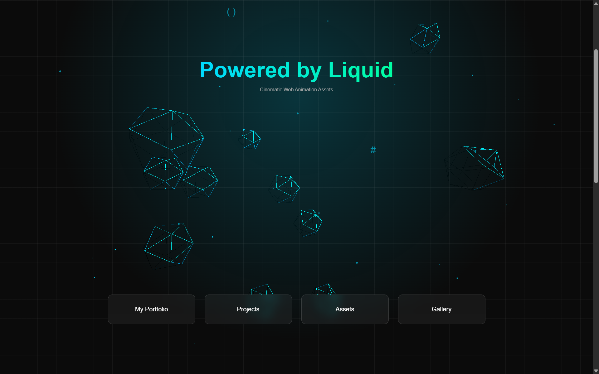

---

# 👋 Hi, I'm Ifti (Liquid)

💻 **Android ROM Developer | Web Developer | UI Animation Builder**

I work on **Android custom ROM device bring-up and build maintenance** and also build **modern web applications and cinematic UI animation assets**.

---

# 🚀 About Me

* 📱 Android Custom ROM **Device Bring-up Maintainer**
* 🌐 **Web Application Developer**
* 🎨 Building **Cinematic Web Animation Assets**
* ⚙️ Focused on **AOSP device integration and build systems**

---

# 🔧 What I Do

* Device bring-up for **AOSP-based custom ROMs**
* Integrate devices into **existing ROM projects**
* Fix **build errors and device configuration issues**
* Maintain **device trees, vendor trees, and kernels**
* Build **interactive UI components and animation assets**

---

# 🌐 Web Animation / UI Assets

### Cinematic Web Animation Assets

🔗 **Live Website**
https://liquid7z.github.io/Liquid/

### Website Preview

[

Features:

* Cinematic landing page animations
* 3D card UI components
* Interactive scroll animations
* Modern portfolio-style web assets
* Apple-inspired motion UI design

---

# 📱 Devices Maintained

**Realme 9 SE (ice)**
Qualcomm Snapdragon **SM8350**

---

# 📦 ROM Builds

The following ROMs have been **built and tested** for **Realme 9 SE (ice)**.

### Custom ROM Builds

**HorizonDroid**
https://sourceforge.net/projects/rmx3461-ice/files/HorizonDroid/

**Lunaris AOSP**
https://sourceforge.net/projects/rmx3461-ice/files/Lunaris-AOSP/

**VoltageOS**
https://sourceforge.net/projects/rmx3461-ice/files/Voltage5.2/

**AlphaDroid**
https://sourceforge.net/projects/rmx3461-ice/files/AlphaDroid/

**DerpFest**
https://sourceforge.net/projects/rmx3461-ice/files/DerpFest/

### RisingOS Revived

Build 1
https://sourceforge.net/projects/rmx3461-ice/files/RisingRevived/

Build 2
https://sourceforge.net/projects/rmx3461-ice/files/RisingOSREvivedv8/

📁 **All Builds**
https://sourceforge.net/projects/rmx3461-ice/files/

> ROM sources belong to their respective projects.
> My role focuses on **device bring-up and build maintenance**.

---

# 🛠 Tech Stack

### Android Development

* AOSP
* Device Bring-up
* Kernel Integration
* Vendor / Device Trees

### Web Development

* Next.js
* React
* Tailwind CSS
* Ionic + React

### Backend

* Firebase Auth
* Firestore
* Cloud Functions

### Tools

Git • Repo • Linux • Docker • Windows

---

# 📊 GitHub Stats

---

# 📈 Contribution Graph

---

## 📫 Connect

---

⭐ **Building Android systems and cinematic web interfaces.**
