 

  

  

---

## 01 / INTRODUCTION

I'm **Ifti**, known online as **Liquid**.

I'm an **Android Custom ROM Developer, AOSP Device Bring-up Maintainer, Linux systems enthusiast, and Web Developer**.

My work focuses on taking Android from the **platform layer to the device layer** — integrating device trees, vendor components, kernels, build systems, and custom ROM environments to create stable and usable experiences.

On the web side, I enjoy building **modern interfaces, interactive experiences, animations, and cinematic UI systems**.

 

---

## 02 / ANDROID & AOSP

### 📱 Device Maintained

**Realme 9 SE — `ice`**

| Component | Details |
|---|---|
| **Device** | Realme 9 SE |
| **Codename** | `ice` |
| **Platform** | Qualcomm |
| **SoC** | Snapdragon SM8350 |
| **Focus** | AOSP / Custom ROM Bring-up |
| **Status** | 🟢 Maintained |

### What I Work On

- Android Custom ROM development
- AOSP device bring-up
- Device tree integration
- Vendor integration
- Kernel integration
- Hardware-specific configuration
- Android build systems
- Build debugging and troubleshooting
- Device testing
- Release preparation

 

`AOSP` · `Device Trees` · `Vendor` · `HAL` · `Kernel` · `Linux` · `Bash` · `ROM Builds`

---

## 03 / WEB DEVELOPMENT

  

---

## 04 / CUSTOM ROM BUILDS

### 📦 Realme 9 SE · `ice`

 

  

### Available Builds

| ROM | Build Directory |
|---|---|
| 🌌 **HorizonDroid** | [Download](https://sourceforge.net/projects/rmx3461-ice/files/HorizonDroid/) |
| 🌙 **Lunaris AOSP** | [Download](https://sourceforge.net/projects/rmx3461-ice/files/Lunaris-AOSP/) |
| ⚡ **VoltageOS** | [Download](https://sourceforge.net/projects/rmx3461-ice/files/Voltage5.2/) |
| 🧬 **AlphaDroid** | [Download](https://sourceforge.net/projects/rmx3461-ice/files/AlphaDroid/) |
| 🌀 **DerpFest** | [Download](https://sourceforge.net/projects/rmx3461-ice/files/DerpFest/) |
| 🚀 **RisingOS Revived** | [Download](https://sourceforge.net/projects/rmx3461-ice/files/RisingRevived/) |
| 🔥 **RisingOS Revived v8** | [Download](https://sourceforge.net/projects/rmx3461-ice/files/RisingOSREvivedv8/) |

> ROM projects and their respective source code belong to their original maintainers. My contribution focuses on **device bring-up, integration, build maintenance, testing, and release builds**.

---

## 05 / TECHNOLOGY STACK

### Android & Systems

### Web

### Development

---

## 06 / GITHUB ANALYTICS

&nbsp;&nbsp;

  

---

## 07 / CONTRIBUTION ACTIVITY

---

## 08 / CONNECT

---

## 10 / CURRENT FOCUS

---

  

